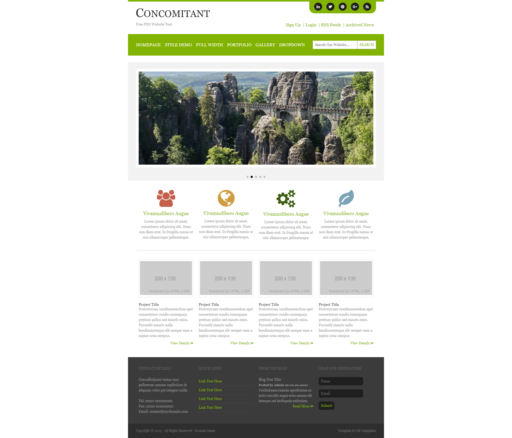

    <h3>This is psd to html practice</h3>
    <h4>
        Preview Live: <a target="_blank"
            href="https://nikhilroy2.github.io/psd_concomitant_to_html/">https://nikhilroy2.github.io/psd_concomitant_to_html/</a>
    </h4>
    

    <h4>Code Used</h4>
    <ul>
        <li>HTML</li>
        <li>CSS</li>
        <li>SCSS</li>
        <li>BOOTSTRAP</li>
        <li>FontAwesome</li>
    </ul>
    <a href="https://www.linkedin.com/in/nikhilroy2/" target="_blank"> Connect Linkedin </a>